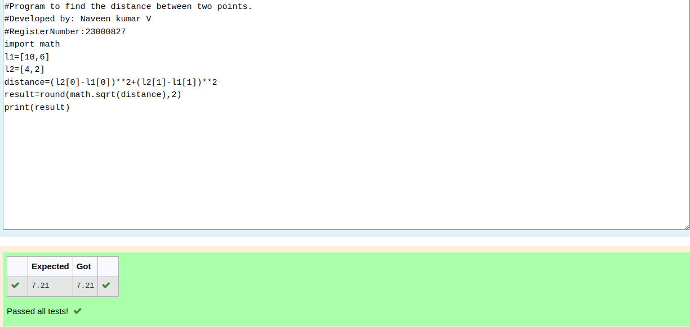

# DISTANCE-BETWEEN-TWO-POINTS

## AIM:
To write a python program to find the distance two 2 points
## ALGORITHM:
### Step 1: 
start the program.
### Step 2: 
assin the values for the variables x2,x1,y2,y1.
### Step 3: 
Substitute the values in the distance formula  
### Step 4: 
print the distance using format to display with two decimal point.
### Step 5: 
end the program.
### PROGRAM:
#Program to find the distance between two points.
#Developed by: Naveen kumar V
#RegisterNumber:23000827
import math
l1=[10,6]
l2=[4,2]
distance=(l2[0]-l1[0])**2+(l2[1]-l1[1])**2
result=round(math.sqrt(distance),2)
print(result)
  

### OUTPUT:

### RESULT:
Thus the distance between two points executed successfully.
